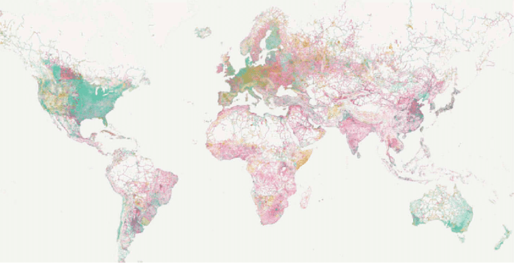

# real-estate-docus

Real Estate Documentation
[Development Process](https://khamuqbil.github.io/real-estate-docus/development-process.md)

# Geolocation Services

### Geolocation and Interactive Maps Providers

- Balady Urban Maps [Urban](https://balady.gov.sa/en/services/urban-maps)

- Mapbox: a Comprehensive location platform empowering with tools to build
  highly customizable maps, navigation solution, search functionalities, and
  design control as core tenets.
- Google Maps

- OpenStreetMap (OSM)

## Differences

- **Coverage:** Google Map

- **Functionality:** Google maps offers many features, such as
  - Real-time traffic.
  - Local search capabilities.
  - geolocation services.

- **Pricing:** OSM is entirely free and open-source, whereas both Google Maps
  and Mapbox have usage base pricing plan.

- **Customization:** Mapbox offering most options, such as.
  - Custom styling
  - Flexible design
